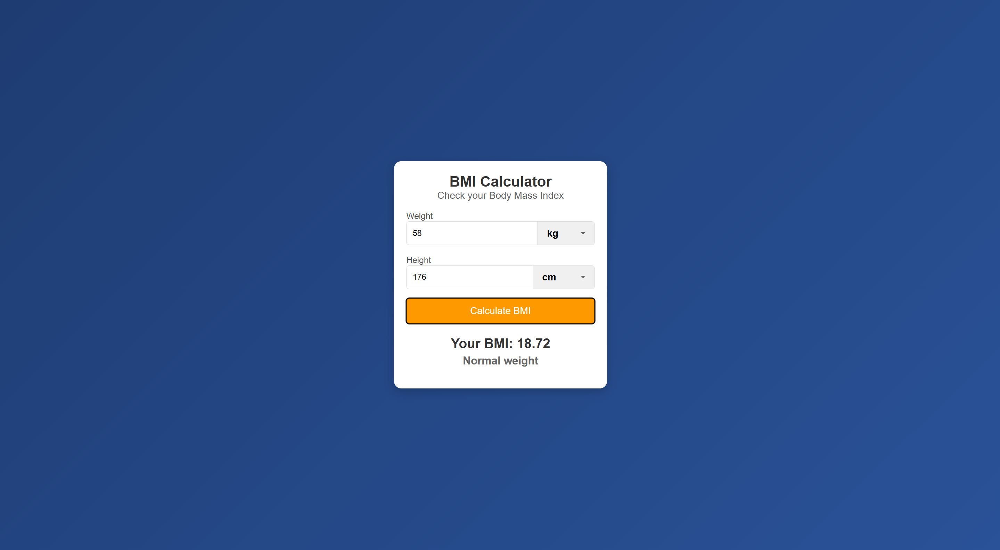

# 🏋️‍♂️ BMI Calculator

🚀 **Live Demo:** [Click here](https://sankarshan77.github.io/bmi-calculator/)

## 📌 About
This is a **free, easy-to-use BMI Calculator** that helps you determine your Body Mass Index (BMI) based on your weight and height. It supports multiple units like kilograms, pounds, inches, and feet.

## 🛠 Features
✅ Supports **multiple weight & height units**  
✅ **Instant BMI calculation** with a single click  
✅ **Responsive Design** - Works on mobile & desktop  
✅ **SEO & Social Media Optimized**  

## 📷 Preview


## 📦 Installation
You can use the BMI Calculator **directly online**, or host it locally:

```sh
# Clone the repository
git clone https://github.com/sankarshan77/bmi-calculator.git

# Open index.html in your browser
